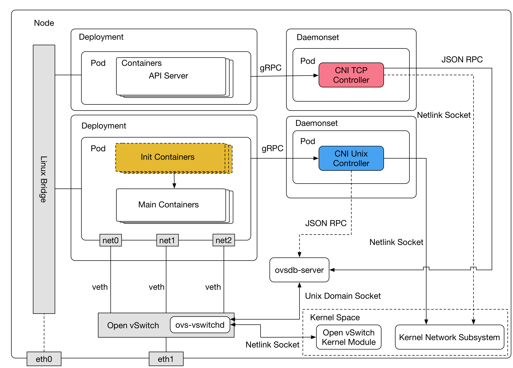

# CNI Network Controller [](https://travis-ci.org/linkernetworks/network-controller) [](https://codecov.io/gh/linkernetworks/network-controller) [](https://goreportcard.com/report/github.com/linkernetworks/network-controller)  [](https://hub.docker.com/r/sdnvortex/network-controller/)



Open vSwitch, Multiple network interfaces that associate with kubernetes pods, etc.

## Table of Contents
* [Development](#development)
* [Usage](#usage)
  + [Run a Server](#run-a-server)
  + [Run a Client](#run-a-client)
    - [Bridge Name](#bridge-name)
    - [Interface Name](#interface-name)
    - [IP Address of the interface](#ip-address-of-the-interface)
    - [Add VLAN tag into the interface](#add-vlan-tag-into-the-interface)
    - [Add a IP routing table(Add route)](#add-a-ip-routing-tableadd-route)
    - [Server](#server)
    - [Example](#example)

## Development

```shell
# generate protocol buffer
make pb

# make server binary
make server

# make client binary
make client

# make test (You should run this before push codes)
make test
```

## Usage

### Run as a server
The network-controller server provide two ways to listen, TCP and Unix domain socket. If you want to run as a UNIX domain socket server, you should specify a path to store the sock file and server will remove that file when server is been terminated.
```shell
./server/network-controller-server -unix=/tmp/a.sock
```
For the TCP server, just use the `IP:PORT` format, for example, `0.0.0.0:50051`
```shell
./server/network-controller-server -tcp=0.0.0.0:50051
```

### Run as a client
The clinet is used for the kubernetes pod to create the veth and you can see the example yaml in `example/kubernetes/*.yaml` to see how to use this client.

For creating a veth for Pod, the client needs the following information
- Pod Name
- Pod Namespace
- Pod UUID
- Target Bridge Name
- The Interface Name in the container
- IP Address of the interface in the container
- Add VLAN tag into the interface
- Add a IP routing table(Add route)
- The server address

The first three variable can passed by the environemtn `POD_NAME`, `POD_NAMESPACE` and `POD_UUID`.

#### Bridge Name
`-b` or `--bridge` Target bridge name.

#### Interface Name
`-n` or `--nic` The interface name in the container.

#### IP Address of the interface
`-i` or `--ip` The ip address of the interface, should be a valid v4 CIDR address.

#### Add VLAN tag into the interface
`-v` or `--vlan` The Vlan Tag of the interface.

#### Add route via gateway. Can add multiple times
`--route-gw` Add route for the destination network cidr on interface.

#### Add route via interface. Can add multiple times
`--route-intf` Add route for the destination network cidr and gateway ip on interface.

#### Add a IP routing table (Add route). Deprecated in the future
`--net` The destination network for add IP routing table, like "-net target".

`-g` or `--gateway` The gateway of the interface subnet.

#### Servers
The clinet support two way to connect to the server, TCP socket and UNIX domain socket. In the TCP mode, use the `IP:PORT` format to connect to TCP server.
```shell
./client/network-controller-client -server=0.0.0.0:50051
```
Fot the UNIX domain socket mode, you should use the `unix://PATH` format to connect to server. Assume the path is `/tmp/a.sock` and you can use the following command to connect
```shell
./client/network-controller-client -server=unix:///tmp/a.sock
```

#### Example
Following is an example of the client and you can see more use the `--help`.
```shell
./clinet/network-controller-client \ 
    --server unix:///tmp/vortex/vortex.sock \ 
    --bridge br100 \
    --nic eth100 \ 
    --ip 192.168.2.2/24 \
    --net 239.0.0.0/4 \
    --gateway 0.0.0.0

./clinet/network-controller-client \ 
    --server unix:///tmp/vortex/vortex.sock \ 
    --bridge br99 \
    --nic eth99 \ 
    --route-intf 239.0.0.0/4 \
    --route-intf 224.0.0.0/4

./clinet/network-controller-client \ 
    --server unix:///tmp/vortex/vortex.sock \ 
    --bridge br98 \
    --nic eth98 \ 
    --route-gw 192.168.2.0/24,192.168.2.254 \
    --route-gw 192.168.1.0/24,192.168.1.1


./clinet/network-controller-client \ 
    --server unix:///tmp/vortex/vortex.sock \ 
    --bridge br98 \
    --nic eth98 \ 
    --route-intf 239.0.0.0/4 \
    --route-gw 192.168.1.0/24,192.168.1.1
```
